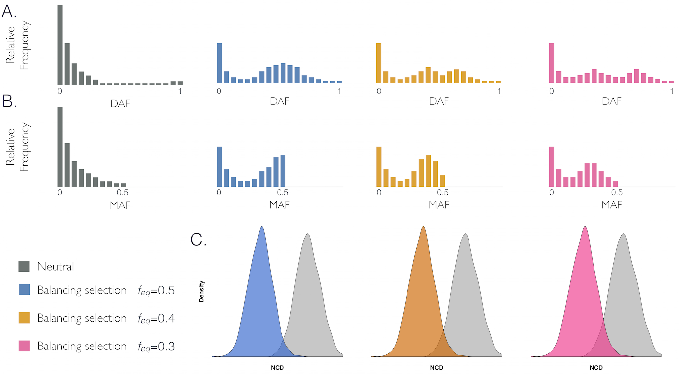

**************************************************
    Author: Bárbara D. Bitarelo

    Created: 27.03.2015

    Last modified: 23 July 2021

    Language: R

**************************************************

Welcome to the NCD repo! 

**UPDATE** (June 2022): We have an R package under development that implements NCD1 and NCD2. CHeck it out [here:](https://github.com/bbitarello/BalSelTools)

**UPDATE**: we have [a wiki](https://github.com/bbitarello/NCD-Statistics/wiki)! It is under construction, and has FAQs, links, and tutorials (soon). 


This repository provided scripts related to the article "Signatures of long-term balancing selection in human genomes": https://academic.oup.com/gbe/advance-article/doi/10.1093/gbe/evy054/4938688


**What are the  NCD (Non-Central Deviation) statistics?**



NCD statistics measure the average difference between allele frequencies in a given region from a deviation point, which we call the 'target frequency (*tf*)'. So, assuming *tf* = 0.5, the more the allele frequencies are close to 0.5, the lower the NCD values. We propose two implementations of this statistic: *NCD1* (only SNPs are required and used as informative sites) and *NCD2* (SNPs and fixed differences are used as informative sites). In the manuscript, *NCD2* as used to scan the human genome.

*******************************************************


Here, we show how to:
* item  Run *NCD1* and *NCD2* (ongoing)
* item  Using examples from the manuscript (see above) which can be extended to other species

*************************************************************************


Running NCD:

this requires:
	
	* SNP input data as a data.table object in R

	* Fixed differences (FD) input data (e.g. human-chimp FD bed file, as used in the manuscript) as a data.table object in R.
	Note: *NCD1* only requires the first input file, whereas NCD2 requires both
        
	* An open R session


*************************************


Example input files are provided in example_input_files/. Refer to the README.md in that directory for further explanations.

*************************************

First:

* clone this repo: go to your directory and clone:

```
git clone https://github.com/bbitarello/NCD-statistics.git
```
Note: this may take a few minutes because large example files are provided!

* go to root NCD directory

```
cd NCD-statistics/
```


Second:

* open an R session and type

```
source('scripts/preamble.R') #loads several packages
source('scripts/NCD_func.R') #loads NCD functions NCD1 and NCD2
readRDS('example_input_files/SNP_test_input.rds')-> SNP_input #necessary for NCD1 and NCD2
readRDS('example_input_files/FD_test_input.rds')-> FD_input  #only necessary for NCD2
system.time(example.run.ncd1<-foreach(x=1:22, .combine="rbind", .packages=c("data.table")) %dopar% NCD1(X=SNP_input[[x]], W=3000, S=1500)); #  6 seconds 
system.time(example.run.ncd2<-foreach(x=1:22, .combine="rbind", .packages=c("data.table")) %dopar%  NCD2(X=SNP_input[[x]], Y=FD_input[[x]],  W=3000, S=1500)); # 9 seconds
```
Note that the runtime will vary considerably depending on computational constraints. My experience with registerDoMC(11) is that each scan for the entire genome takes about one minute. The examples here encompass a smaller proportion of the genome and run in a few seconds. See example_input_files/README.md 

**Important:** This is an example. It is a roadmap of how NCD can be used for other input data (including non-SNP data). Even though the example input data is real (phase 3 1000 Genomes), it does not reproduce the findings from the paper.


**Acnowledgements**

Many thanks to @VitorAguiar  (https://github.com/VitorAguiar) with optimization of the NCD codes.

**Updates**

Soon: will fix NCD2 so that it runs even when there are no FDs in the input file.(**update: fixed**)
**Update**: Fixed issue with NCD2 output.

